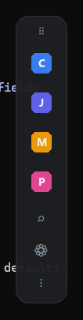

# QuickDock

Uma barra de atalhos leve, moderna e **sempre visível** para Windows.
Abre programas, pastas, URLs, arquivos, comandos, scripts, **várias URLs de
uma vez** e **macros** (sequências com espera) com um único clique.



---

## ✨ Recursos

| Requisito | Status |
|---|---|
| Sempre acima das demais janelas (Always On Top) | ✅ |
| Pequena e discreta (sem barra de título) | ✅ |
| Arrastável para qualquer posição | ✅ |
| Posição salva e restaurada automaticamente | ✅ |
| Início rápido e baixo consumo de memória | ✅ |
| Barra **vertical** (padrão) ou **horizontal** | ✅ |
| Ícone + nome + tooltip por atalho | ✅ |
| Nome do botão: **oculto**, **ao lado** ou **embaixo** (fonte pequena) | ✅ |
| Abrir URL / programa / pasta / arquivo / comando / script (.bat/.ps1/.py) | ✅ |
| **Abrir URL(s) em um perfil específico do Chrome** (menu por nome) | ✅ |
| Tela de configurações (adicionar, editar, excluir) | ✅ |
| Reordenar por **drag and drop** (e setas ▲▼) | ✅ |
| Escolher ícone, ação, argumentos, working directory, abrir minimizado | ✅ |
| Persistência em **JSON** editável à mão | ✅ |
| Busca rápida de atalhos | ✅ |
| Atalho global (padrão `Ctrl+Espaço`) para mostrar/esconder | ✅ |
| **Roda em segundo plano** com ícone na **bandeja do sistema** (sem ocupar a barra de tarefas) | ✅ |
| **Iniciar com o Windows** e/ou **iniciar escondido** (só na bandeja) | ✅ |
| Esconder automaticamente na borda | ✅ |
| Ajuste de transparência | ✅ |
| Ícone por atalho: **imagem**, **emoji** (seletor com busca) ou **letra** | ✅ |
| Tema claro e escuro (e "sistema") | ✅ |
| Bordas arredondadas + animação suave de abertura | ✅ |
| Bloquear posição | ✅ |
| Fixar em qualquer lado da tela | ✅ |
| **Abrir várias URLs** ao mesmo tempo | ✅ |
| **Macros** (pasta → espera → app → espera → script...) | ✅ |
| **Sub-botões** (grupos que expandem num painel, com aninhamento) | ✅ |

---

## 📁 Estrutura do projeto

```
QuickDock/
├── main.py                     # Ponto de entrada (python main.py)
├── requirements.txt            # Dependências
├── build.bat                   # Gera o .exe com PyInstaller
├── README.md
└── quickdock/                  # Código-fonte (modularizado)
    ├── __init__.py
    ├── models.py               # Estruturas de dados (Shortcut, MacroStep, Settings)
    ├── storage.py              # Persistência em JSON  (PERSISTÊNCIA)
    ├── actions.py              # Execução das ações     (LÓGICA)
    ├── hotkeys.py              # Atalho global de teclado
    ├── tray.py                 # Ícone na bandeja do sistema (segundo plano)
    ├── autostart.py            # Iniciar com o Windows (registro)
    ├── icons.py                # Ícones (Pillow + extração via pywin32)
    ├── tooltip.py              # Dica ao passar o mouse
    ├── shortcut_button.py      # Widget de um botão      (INTERFACE)
    ├── dock.py                 # Janela principal / barra (INTERFACE)
    ├── settings_window.py      # Tela de configurações   (INTERFACE)
    ├── editor.py               # Diálogos de editar atalho / macro
    └── search.py               # Busca rápida sobreposta
```

A arquitetura separa claramente **interface** (`dock`, `*_window`, `editor`,
`search`, `shortcut_button`), **lógica** (`actions`, `hotkeys`) e
**persistência** (`storage`, `models`). Para adicionar um novo tipo de ação,
basta: registrar a constante em `models.py`, tratá-la em `actions.py` e,
opcionalmente, dar-lhe uma cor/ícone em `icons.py`.

### 📌 Onde ficam os dados (settings + atalhos)

Por padrão, no **perfil do usuário**, para **sobreviver às atualizações** do
programa:

```
%APPDATA%\QuickDock\settings.json
%APPDATA%\QuickDock\shortcuts.json
```

Abra rápido colando `%APPDATA%\QuickDock` na barra do Explorer. Assim você pode
substituir/reinstalar o `.exe` à vontade que **seus atalhos não são apagados**.

- **Migração automática:** se você já tinha uma pasta `data/` ao lado do app
  (versões anteriores), os arquivos são copiados para `%APPDATA%\QuickDock` na
  primeira execução — sem perder nada.
- **Modo portátil:** crie um arquivo vazio chamado `portable.txt` ao lado do
  executável para os dados voltarem a ficar em `data/` (útil para pendrive).

---

## 🚀 Como executar

Requisitos: **Windows** e **Python 3.10+**.

```bat
:: 1) (opcional) crie um ambiente virtual
python -m venv .venv
.venv\Scripts\activate

:: 2) instale as dependências
pip install -r requirements.txt

:: 3) rode
python main.py
```

Na primeira execução, os dados são criados em `%APPDATA%\QuickDock` com alguns
atalhos de exemplo (veja *Onde ficam os dados* acima).

### Como usar a barra

- **Clique** em um botão → executa a ação.
- **Clique direito** em um botão → edita aquele atalho.
- **Arraste** pela alça `⠿` (topo/esquerda) → move a barra.
- Botão **⌕** → busca rápida.  Botão **⚙** → configurações.  Botão **⋮** → menu.
- **Clique direito na alça** → abre o menu completo (orientação, fixar na
  borda, tema, transparência, esconder automaticamente, bloquear, iniciar
  escondido, iniciar com o Windows, etc.).
- **`Ctrl+Espaço`** (configurável) → mostra/esconde a barra de qualquer lugar.

### Rodar em segundo plano (bandeja do sistema)

O QuickDock **não ocupa um botão na barra de tarefas**: ele vive na **bandeja
do sistema** (área de notificação, ao lado do relógio). Pelo ícone da bandeja
você pode:

- **Clique** no ícone → mostra/esconde a barra (mesma ação do `Ctrl+Espaço`).
- **Clique direito** → menu com *Mostrar/Esconder*, *Busca rápida*,
  *Configurações* e *Sair*.

No menu (clique direito na alça) há duas opções ligadas ao segundo plano:

- **Iniciar escondido (bandeja):** ao abrir, o app fica só na bandeja; a barra
  aparece quando você quiser (ícone da bandeja ou `Ctrl+Espaço`).
- **Iniciar com o Windows:** registra o app para abrir sozinho no login (chave
  *Run* do usuário atual — não exige administrador).

> Para fechar de vez, use **Sair** (no menu da bandeja ou da alça).

---

## 🗂️ Formato do JSON (`data/shortcuts.json`)

É uma **lista** de atalhos. Você pode editá-la à mão e usar
*Menu → Recarregar atalhos* (ou reabrir o app).

### Atalho simples (URL)

```json
{
  "name": "Claude Produção",
  "icon": "icons/claude.png",
  "type": "url",
  "target": "https://claude.ai",
  "working_directory": "D:\\Produção"
}
```

### Várias URLs de uma vez

```json
{
  "name": "Jurídico Pro",
  "type": "multi_url",
  "targets": [
    "https://app.juridicopro.com.br",
    "https://chatgpt.com",
    "https://claude.ai"
  ],
  "tooltip": "Abrir tudo do jurídico"
}
```

### Abrir URL(s) em um perfil específico do Chrome

Abre uma ou mais URLs num perfil escolhido do Chrome. No editor, o campo
**"Perfil do Chrome"** mostra seus perfis pelo nome (ex.: *Gabriel*, *Jurídico
Pro*); no JSON, `browser_profile` é a **pasta** do perfil (`Default`,
`Profile 1`, …). Equivale a `chrome.exe --profile-directory="Profile 1" <urls>`.

```json
{
  "name": "Tarefas (perfil Jurídico)",
  "type": "chrome",
  "browser_profile": "Default",
  "targets": [
    "https://app.juridicopro.com/tarefas",
    "https://app.juridicopro.com/trafego-pago"
  ]
}
```

### Programa com argumentos, pasta inicial e minimizado

```json
{
  "name": "VS Code",
  "type": "program",
  "target": "C:\\Program Files\\Microsoft VS Code\\Code.exe",
  "args": "D:\\Produção --new-window",
  "working_directory": "D:\\Produção",
  "minimized": false
}
```

### Script (.py / .ps1 / .bat)

```json
{
  "name": "Backup",
  "type": "script",
  "target": "C:\\scripts\\backup.ps1",
  "args": "-Full",
  "working_directory": "C:\\scripts"
}
```

### Macro (sequência com esperas)

```json
{
  "name": "Produção",
  "type": "macro",
  "tooltip": "Rotina de produção",
  "steps": [
    { "type": "folder", "target": "D:\\Produção", "wait": 1 },
    { "type": "url", "target": "https://claude.ai", "wait": 1 },
    { "type": "url", "target": "https://chatgpt.com", "wait": 1 },
    { "type": "script", "target": "C:\\scripts\\iniciar.bat", "wait": 0 }
  ]
}
```

### Grupo com sub-botões (`group`)

Ao clicar, abre um painel ao lado da barra com os atalhos filhos. Cada filho
pode ser de **qualquer tipo** — inclusive **outro grupo** (aninhamento). O
painel fecha ao clicar num sub-botão, ao clicar no grupo de novo, com `Esc`,
ou quando o mouse se afasta.

```json
{
  "name": "Dev",
  "type": "group",
  "tooltip": "Ferramentas de desenvolvimento",
  "children": [
    { "name": "VS Code", "type": "program", "target": "C:\\...\\Code.exe" },
    { "name": "ChatGPT", "type": "url", "target": "https://chatgpt.com" },
    {
      "name": "Mais IAs", "type": "group",
      "children": [
        { "name": "Claude", "type": "url", "target": "https://claude.ai" },
        { "name": "Gemini", "type": "url", "target": "https://gemini.google.com" }
      ]
    }
  ]
}
```

> Você também pode montar grupos pela interface: em *Configurações → Atalhos*,
> adicione um atalho do tipo **“Grupo (sub-botões)”** e use **“＋ Sub-botão”**
> para incluir/editar/reordenar os filhos. Os sub-botões também aparecem na
> **busca rápida** (com o caminho no nome, ex.: `Dev ▸ VS Code`).

> **Tipos aceitos** (`type`): `url`, `multi_url`, `chrome`, `program`, `folder`,
> `file`, `command`, `script`, `macro`, `group`.
> Caminhos aceitam variáveis de ambiente, ex.: `%USERPROFILE%`, `%APPDATA%`.
> Barras normais (`/`) e invertidas (`\\`) funcionam na *pasta inicial*.

> **Ícone (`icon`) — três formas:**
> 1. **Imagem:** caminho para `.png/.ico/.jpg` (botão **…** no editor).
> 2. **Emoji:** botão **😀 Emoji** abre um seletor com busca; grava como
>    `"icon": "emoji:🚀"` (você também pode digitar/colar o emoji direto).
> 3. **Letra (padrão):** se ficar vazio, usa o ícone nativo do programa/arquivo
>    (via `pywin32`) ou um avatar colorido com a inicial do nome.

> **Sobre `command` e `script`:** abrem um **console dedicado e persistente**
> (`cmd /k`), ideal para ferramentas de linha de comando interativas — por
> exemplo, `command` = `claude` com *pasta inicial* `G:\...\PRODUÇÃO` abre um
> terminal já naquela pasta rodando o `claude`. O console permanece aberto
> para você ver a saída/erros. Use `program` (e não `command`) para abrir
> um `.exe` gráfico sem janela de terminal.

---

## 🛠️ Gerar o executável (.exe) com PyInstaller

O jeito mais simples é rodar o script pronto:

```bat
build.bat
```

Isso instala o PyInstaller e gera **`dist\QuickDock.exe`** — um único arquivo,
sem janela de console.

### Ou manualmente

```bat
pip install pyinstaller
pyinstaller --name QuickDock --onefile --noconsole ^
  --hidden-import win32gui --hidden-import win32ui --hidden-import win32con ^
  --collect-all customtkinter ^
  --collect-submodules pystray ^
  main.py
```

Observações:

- Os dados (settings + atalhos) ficam em **`%APPDATA%\QuickDock`**, então você
  pode **atualizar o `.exe` sem perder seus atalhos**. Basta substituir o
  `QuickDock.exe`. (Para versão de pendrive, crie um `portable.txt` ao lado do
  `.exe`.)
- `--collect-all customtkinter` garante que os temas/assets da biblioteca
  sejam incluídos.
- Os `--hidden-import` do `win32*` garantem a extração de ícones nativos.

### Iniciar junto com o Windows (opcional)

O jeito mais fácil é pelo próprio app: **clique direito na alça → “Iniciar com
o Windows”**. Isso registra o QuickDock na chave *Run* do usuário atual (não
exige administrador). Combine com **“Iniciar escondido (bandeja)”** para ele
subir direto em segundo plano.

Alternativa manual: pressione `Win+R`, digite `shell:startup` e crie um atalho
apontando para `QuickDock.exe` (ou para `pythonw.exe main.py`).

---

## 🧩 Dependências

- [customtkinter](https://github.com/TomSchimansky/CustomTkinter) — interface moderna
- [Pillow](https://python-pillow.org/) — ícones e avatares
- [pywin32](https://github.com/mhammond/pywin32) — extração de ícones nativos
- [keyboard](https://github.com/boppreh/keyboard) — atalho global
- [pystray](https://github.com/moses-palmer/pystray) — ícone na bandeja do sistema

> O atalho global depende da biblioteca `keyboard`. Se ela não estiver
> disponível (ou faltar permissão), o app continua funcionando normalmente,
> apenas sem o atalho global — o restante da interface segue operante.
>
> Da mesma forma, o ícone da bandeja depende de `pystray`: se faltar, o app
> ainda abre (a barra fica visível normalmente), apenas sem o ícone na bandeja.

---

## 🐛 Solução de problemas

| Sintoma | Causa / Solução |
|---|---|
| Atalho global não funciona | Rode o terminal/app **como Administrador**, ou troque o atalho em *Configurações → Geral*. |
| Cantos não ficam transparentes | Alguns drivers/ambientes não suportam `-transparentcolor`; a barra funciona mesmo assim (cantos retos). |
| Ícone do programa não aparece | Nem todo arquivo tem ícone embutido; será usado um avatar com a inicial. Você pode definir uma imagem manualmente. |
| Editei o JSON e não mudou | Use *Menu (⋮/clique direito) → Recarregar atalhos*. |
| Ícone não aparece na bandeja | Instale a dependência `pystray` (`pip install -r requirements.txt`); no `.exe`, gere com o `build.bat` atualizado (`--collect-submodules pystray`). O ícone pode estar oculto no “estouro” da bandeja (seta ˄) — arraste-o para fixá-lo. |
| Some da barra de tarefas mas não sei acessar | É o comportamento esperado (segundo plano). Use o ícone da bandeja ou `Ctrl+Espaço`. |

---

## 📄 Licença

Distribuído sob a licença **MIT** — uso livre, inclusive comercial. Veja o
arquivo [`LICENSE`](LICENSE).
